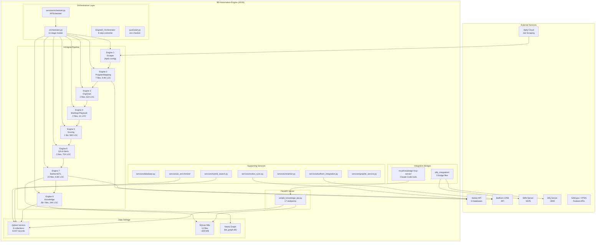
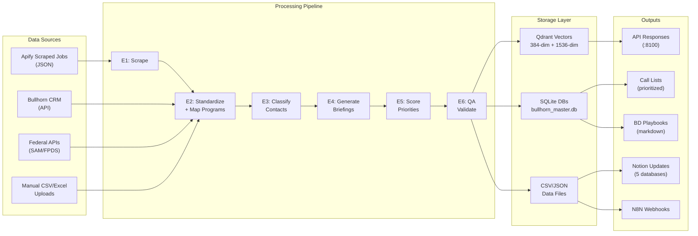
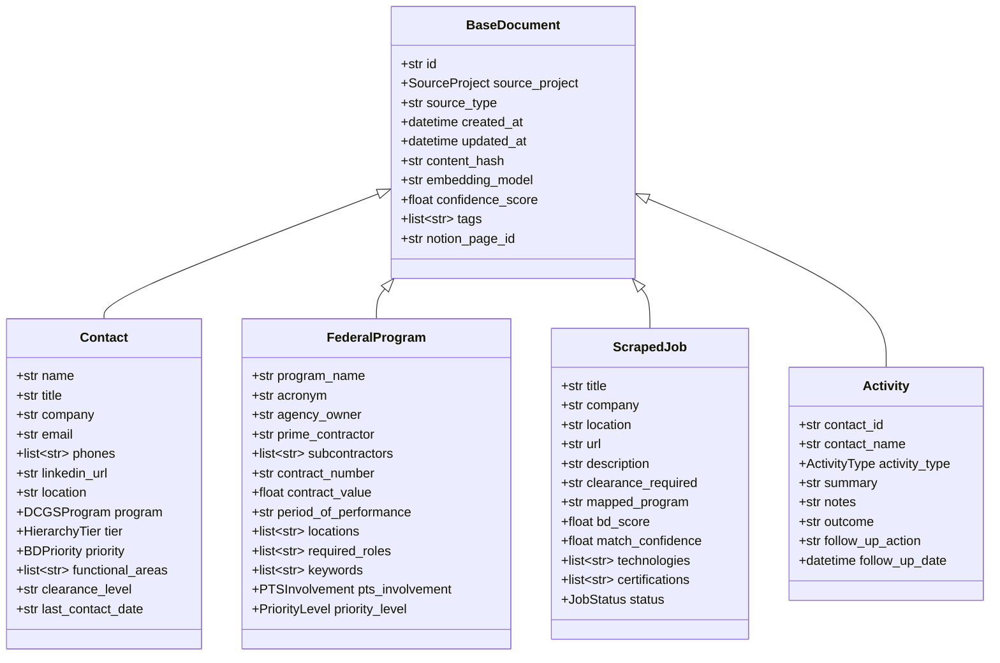
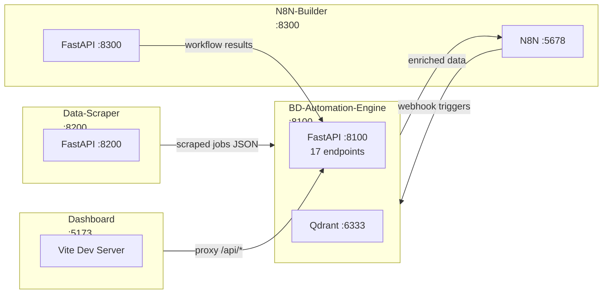

# BD-Automation-Engine — Comprehensive Project Audit Report

**Phase 0 Assessment | Generated 2026-02-16**
**Scope:** BD-Automation-Engine repository (all 8 engines + supporting infrastructure)

---

## Table of Contents

1. [File Inventory](#1-file-inventory)
2. [Architecture Map](#2-architecture-map)
3. [Data Model Inventory](#3-data-model-inventory)
4. [Dependency Audit](#4-dependency-audit)
5. [Dead Code Candidates](#5-dead-code-candidates)
6. [Cross-Repo Integration Points](#6-cross-repo-integration-points)
7. [Test Coverage](#7-test-coverage)
8. [Technical Debt Scorecard](#8-technical-debt-scorecard)
9. [Consolidation Readiness Assessment](#9-consolidation-readiness-assessment)

---

## 1. FILE INVENTORY

### Summary Statistics

| Metric | Count |
|--------|-------|
| Total Python files (BD-Engine proper) | ~150 |
| Total Python LOC | ~63,000 |
| SQLite databases | 12 (6 duplicates) |
| N8N workflow JSONs | 18 |
| CSV data files | 816 |
| JSON data files | 1,727 |
| Markdown docs | 1,415 |
| Excel files | 66 |
| YAML/Docker configs | 59 |

### Engine Directory Inventory

#### Engine0_Orchestrator/ (1 file, 320 lines)
| File | Lines | Description |
|------|-------|-------------|
| `orchestrator.py` | 320 | 8-step pipeline controller with step tracking, history persistence, status monitoring |

#### Engine1_Scraper/ (config only)
| File | Lines | Description |
|------|-------|-------------|
| `data/dataset_puppeteer-scraper_*.json` | — | Apify actor output datasets (raw scraped jobs) |
| `Configurations/` | — | Apify actor configuration JSONs |

*No Python scripts — Engine 1 runs externally on Apify cloud.*

#### Engine2_ProgramMapping/ (7 files, 6,890 lines)
| File | Lines | Description |
|------|-------|-------------|
| `scripts/pipeline.py` | 1,211 | Main 7-stage pipeline coordinator with stage management |
| `scripts/enrich_insight_global_jobs.py` | 1,178 | Insight Global jobs enrichment pipeline |
| `scripts/program_mapper.py` | 1,001 | Multi-signal job-to-program matching engine |
| `scripts/job_standardizer.py` | 878 | LLM-powered field extraction and standardization |
| `scripts/generate_bd_playbook.py` | 632 | Generate BD playbooks from enriched jobs |
| `scripts/exporters.py` | 642 | Notion CSV (24 cols) + n8n webhook JSON export |
| `scripts/full_pipeline.py` | 152 | Complete 6-stage mapping pipeline orchestrator |

#### Engine3_OrgChart/ (2 files, 523 lines)
| File | Lines | Description |
|------|-------|-------------|
| `scripts/contact_classifier.py` | 363 | 6-tier hierarchy classification via regex on job titles |
| `scripts/contact_lookup.py` | 160 | Contact database lookup and enrichment |

#### Engine4_Briefing/ (1 file, 121 lines)
| File | Lines | Description |
|------|-------|-------------|
| `scripts/briefing_generator.py` | 121 | Generates BD briefing markdown from contact + program data |

#### Engine4_Playbook/ (1 file, 915 lines)
| File | Lines | Description |
|------|-------|-------------|
| `scripts/bd_playbook_generator.py` | 915 | Full BD playbooks with email templates, call scripts, talking points |

#### Engine5_Scoring/ (1 file, 582 lines)
| File | Lines | Description |
|------|-------|-------------|
| `scripts/bd_scoring.py` | 582 | BD priority scoring (0-100) with 4-tier classification |

#### Engine6_QA/ (2+ files, ~754 lines)
| File | Lines | Description |
|------|-------|-------------|
| `scripts/qa_feedback.py` | 420 | QA gating, review queues, feedback collection |
| `scripts/alerts.py` | 334 | Alert generation and delivery system |
| `quality_monitor.py` | — | Quality monitoring service |

#### Engine7_BullhornETL/ (22 files, ~9,782 lines)
| File | Lines | Description |
|------|-------|-------------|
| `bullhorn_etl_v2.py` | 1,205 | V2 ETL with enhanced processing |
| `ingest_new_notes.py` | 1,102 | Ingest and parse call notes |
| `import_coworker_data.py` | 1,038 | Import coworker/contact data |
| `bullhorn_etl.py` | 913 | Main Bullhorn CRM data extraction (V1) |
| `intelligent_contact_classifier.py` | 754 | AI-powered contact classification |
| `dashboard_integration.py` | 554 | Export data for dashboard consumption |
| `integrate_call_notes.py` | 537 | Parse and integrate call notes |
| `export_coworker_playbook.py` | 549 | Generate coworker outreach playbooks |
| `analyze_call_notes.py` | 552 | Extract insights from call notes |
| `build_prime_contact_databases.py` | 498 | Build prime contractor contact DBs |
| `database_schema.py` | 421 | Bullhorn database schema definitions |
| `contact_scoring.py` | 382 | Score contacts by BD priority |
| `program_mapper.py` | 400 | Map jobs to programs (Bullhorn-specific) |
| `analyze_prime_contacts.py` | 405 | Analyze prime contractor contacts |
| `bullhorn_activity_logger.py` | 351 | Log and track BD activities |
| `past_performance_report.py` | 323 | Generate past performance reports |
| `export_to_notion.py` | 321 | Export Bullhorn data to Notion |
| `bd_intelligence_report.py` | 319 | Generate BD intelligence reports |
| `export_intelligence_dashboard.py` | 315 | Dashboard data export |
| `link_to_federal_programs.py` | 304 | Link placements to federal programs via SQLite |
| `data_cleanup.py` | 285 | Clean and normalize Bullhorn data |
| `financial_analysis.py` | 278 | Financial analysis of contracts |
| `run_pipeline.py` | 261 | 7-step pipeline orchestrator |

#### Engine8_Knowledge/ (68+ files, ~24,270 lines)
| File | Lines | Description |
|------|-------|-------------|
| `enrich_reindex_all.py` | 1,183 | Reindex all data with enrichment |
| `index_all_data.py` | 922 | Master indexing coordinator |
| `indexer.py` | 847 | Core indexing engine |
| `vector_store.py` | 845 | Qdrant vector database interface |
| `classifier_pipeline.py` | 790 | ML classification pipeline |
| `index_staged_data.py` | 673 | Index staged/batch data |
| `document_processor.py` | 611 | Process and chunk documents |
| `recompete_predictor.py` | 548 | Predict contract recompete timing |
| `auto_tagger.py` | 522 | Auto-tag documents with metadata |
| `file_watcher.py` | 497 | Watch directories for new data |
| `priority_index_full.py` | 483 | Priority-based indexing |
| `rag_engine.py` | 418 | RAG query engine |
| `treesitter_parser.py` | 409 | Parse code with tree-sitter |
| `hybrid_retriever.py` | 377 | Hybrid search (dense + sparse) |
| `memory_system.py` | 367 | Memory layer for agent context |
| `populate_lightrag.py` | 364 | Populate LightRAG knowledge base |
| `daily_action_engine.py` | 344 | Generate daily action items |
| `call_prep_generator.py` | 345 | Generate call prep briefings |
| `lancedb_hybrid.py` | 330 | LanceDB hybrid search |
| `query_router.py` | 254 | Route queries to optimal engine |
| `rag_router.py` | 251 | RAG routing logic |
| `memory_layer.py` | 249 | Memory persistence layer |
| `redis_cache.py` | 245 | Redis caching layer |
| `claim_tracker.py` | 242 | Track claimed contacts/leads |
| `docling_extractor.py` | 231 | Extract text from documents |
| `index_engine2_programs.py` | 223 | Index program data |
| `lightrag_engine.py` | 209 | LightRAG integration |
| `dedup_programs.py` | 207 | Deduplicate program records |
| `outreach_claim_bridge.py` | 198 | Bridge between outreach and claims |
| `index_bullhorn_contacts.py` | 194 | Index Bullhorn contacts |
| `index_engine3_contacts.py` | 189 | Index OrgChart contacts |
| `index_engine1_jobs.py` | 187 | Index scraped jobs |
| `index_from_json.py` | 181 | Index data from JSON files |
| `web_scrapers.py` | 177 | Web scraping (Firecrawl + crawl4ai) |
| `pageindex_engine.py` | 171 | PageIndex vectorless RAG with tree search |
| `index_dashboard_data.py` | 170 | Index dashboard data |
| `index_all_docs.py` | 155 | Index all document types |
| `init_bm25.py` | 150 | Initialize BM25 sparse index |
| `docling_processor.py` | 125 | Docling document processing |
| `sparse_encoder.py` | 114 | Sparse vector encoding |
| `reindex_batch.py` | 111 | Batch reindexing utility |
| `hybrid_collections.py` | 96 | Hybrid collection management |
| `master_index_all.py` | 87 | Master indexing script |

**Engine8 Agents (4 files):**
| File | Lines | Description |
|------|-------|-------------|
| `agents/bd_strategy_agent.py` | — | BD strategy recommendations via Claude |
| `agents/contact_finder_agent.py` | — | Find contacts by criteria via vector search |
| `agents/program_intel_agent.py` | — | Federal program intelligence via RAG |
| `agents/company_research_agent.py` | — | Company research via multi-source lookup |

**Engine8 Evaluation:**
| File | Lines | Description |
|------|-------|-------------|
| `evaluation/ragas_evaluator.py` | 126 | RAGAS evaluation framework (faithfulness, relevancy, precision, recall) |

### Root-Level Python Files

| File | Lines | Description |
|------|-------|-------------|
| `orchestrator.py` | 976 | Master 11-stage pipeline orchestrator (all engines) |
| `simple_knowledge_api.py` | 470 | Main FastAPI server on port 8100 |
| `quickstart.py` | 345 | Environment checker and pipeline launcher |
| `launch_parallel_indexing.py` | 107 | Parallel indexing workers for contacts (426K) + activities (405K) |

### Supporting Directories

#### services/ (17 files, ~5,443 lines)
| File | Lines | Description |
|------|-------|-------------|
| `ai_enrichment/engine.py` | 652 | AI enrichment engine |
| `database.py` | 641 | Database connection and ORM layer |
| `notion_sync.py` | 584 | Notion database synchronization |
| `bullhorn_integration.py` | 481 | Bullhorn API integration |
| `scheduler.py` | 408 | APScheduler task scheduling service |
| `ai_enrichment/orchestrator.py` | 393 | AI enrichment orchestrator |
| `hybrid_search.py` | 386 | Hybrid search service |
| `ai_enrichment/notion_client.py` | 283 | Notion API client |
| `notion_qdrant_sync.py` | 276 | Sync Notion to Qdrant vectors |
| `ai_enrichment/run_bd_opportunities_enrichment.py` | 270 | Enrich BD opportunities |
| `ai_enrichment/run_dcgs_retry.py` | 222 | Retry failed DCGS enrichments |
| `ai_enrichment/run_dcgs_enrichment.py` | 211 | Enrich DCGS contacts |
| `reranker.py` | 208 | Search result reranking |
| `ai_enrichment/run_enrichment.py` | 156 | Generic enrichment runner |
| `graphiti_service.py` | 115 | Graphiti knowledge graph service |
| `ai_enrichment/run_basic_enrichment.py` | 93 | Basic enrichment pipeline |

#### scripts/ (37 files, ~16,556 lines)
| File | Lines | Description |
|------|-------|-------------|
| `data_correlation/correlation_engine.py` | 2,393 | Cross-dataset correlation engine |
| `gen_architecture.py` | 1,756 | Generate architecture diagrams |
| `architecture/html_emitter.py` | 1,687 | Generate HTML architecture docs |
| `notion_schema/notion_schema_manager.py` | 788 | Manage Notion database schemas |
| `job_ingestion/relational_enrichment.py` | 661 | Relational data enrichment |
| `generate_pipeline_report.py` | 659 | Pipeline status reports |
| `job_opportunities_parser.py` | 627 | Parse job opportunity data |
| `job_ingestion/ingestion_pipeline.py` | 520 | Job ingestion orchestrator |
| `bd_playbook_generator.py` | 493 | BD playbook generation |
| `create_enriched_spreadsheet.py` | 463 | Create enriched Excel sheets |
| `job_ingestion/job_parser.py` | 446 | Parse job postings |
| `test_phase4_agents.py` | 433 | Test Phase 4 agent systems |
| `merge_enriched_federal_programs.py` | 421 | Merge federal program data |
| `create_call_sheet.py` | 409 | Generate call sheets |
| `job_ingestion/pts_past_performance.py` | 379 | PTS past performance lookup |
| `verify_pipeline.py` | 378 | Verify pipeline integrity |
| `job_ingestion/ai_enrichment.py` | 358 | AI-powered job enrichment |
| `analyze_contact_gaps.py` | 313 | Identify contact data gaps |
| `convert_data_to_json.py` | 274 | Convert CSV/Excel to JSON |
| `create_unified_collections.py` | 178 | Create unified Qdrant collections |
| `health_check.py` | 137 | System health check |
| *(+ 16 more architecture/ and utility scripts)* | — | — |

#### dify_integration/ (5 files, ~2,465 lines)
| File | Lines | Description |
|------|-------|-------------|
| `tools_config.py` | 564 | 34 external tools for Dify |
| `dify_n8n_bridge.py` | 524 | Bridge Dify ↔ n8n workflows |
| `dify_apps.py` | 477 | Pre-built Dify app templates |
| `dify_crewai_bridge.py` | 468 | Bridge Dify ↔ CrewAI agents |
| `dify_qdrant_bridge.py` | 401 | Bridge Dify ↔ Qdrant vector DB |

#### design_intelligence/ (2 files, ~1,232 lines)
| File | Lines | Description |
|------|-------|-------------|
| `component_library.py` | 655 | Reusable UI components (React/Tailwind generation) |
| `design_system.py` | 577 | Design system for 5 industry types |

#### config/ (3 files, ~391 lines)
| File | Lines | Description |
|------|-------|-------------|
| `settings.py` | 239 | Pydantic BaseSettings with all env vars |
| `logging_config.py` | 90 | Logging configuration |
| `resilience.py` | 62 | Retry + circuit breaker patterns |

#### models/ (5 files, ~279 lines)
| File | Lines | Description |
|------|-------|-------------|
| `contacts.py` | 87 | Contact model (HierarchyTier, BDPriority, DCGSProgram, LocationHub enums) |
| `programs.py` | 59 | FederalProgram model (PTSInvolvement, PriorityLevel enums) |
| `jobs.py` | 53 | ScrapedJob model (JobStatus enum) |
| `activities.py` | 45 | Activity model (ActivityType enum: 8 types) |
| `base.py` | 35 | BaseDocument model (SourceProject enum) |

#### mcp/ (1 file, 410 lines)
| File | Lines | Description |
|------|-------|-------------|
| `knowledge-mcp-server/server.py` | 410 | MCP server exposing search/ask/program-intel/company-contacts tools |

### Orphaned / Duplicate Files

| File | Status | Canonical Location |
|------|--------|--------------------|
| `data/bullhorn_master.db` (293 MB) | **DUPLICATE** | `Engine7_BullhornETL/data/bullhorn_master.db` |
| `data/bd_graph.db` (804K) | **DUPLICATE** | `Engine8_Knowledge/data/bd_graph.db` |
| `data/memories.db` (40K) | **DUPLICATE** | `Engine8_Knowledge/data/memories.db` |
| `data/page_index.db` (24K) | **DUPLICATE** | `Engine8_Knowledge/data/page_index.db` |
| `data/checkpoints_meta.db` (32K) | **ORPHAN** | No canonical engine owner |
| `Engine7_BullhornETL/data/bullhorn.db` (0 bytes) | **EMPTY** | Dead file |
| `Engine7_BullhornETL/bullhorn_etl.py` | **SUPERSEDED** | V1 replaced by `bullhorn_etl_v2.py` |
| `Engine4_Briefing/` vs `Engine4_Playbook/` | **SPLIT** | Two directories for Engine 4 |

### N8N Workflow Files (18 total)

| File | Description |
|------|-------------|
| `n8n/PTS_BD_WF1_Apify_Job_Scraper_Intake.json` | Job scraper intake v1 |
| `n8n/PTS_BD_WF1_Apify_Job_Scraper_Intake_v2.json` | Job scraper intake v2 |
| `n8n/PTS_BD_WF2_AI_Enrichment_Processor.json` | AI enrichment workflow |
| `n8n/PTS_BD_WF3_Hub_to_BD_Opportunities.json` | Hub to BD opportunities |
| `n8n/PTS_BD_WF4_Contact_Classification.json` | Contact classification |
| `n8n/PTS_BD_WF5_Hot_Lead_Alerts.json` | Hot lead alerting |
| `n8n/PTS_BD_WF6_Weekly_Summary_Report.json` | Weekly summary generation |
| `n8n/BD_Master_Orchestration_Workflow.json` | Master orchestration |
| `n8n/Prime_TS_BD_Intelligence_System_v2.1.json` | Prime TS BD system |
| `n8n/Hub_to_BD_Opportunities_Pipeline.json` | Hub to BD pipeline |
| `n8n/Clearance_Job_RAG_Agent.json` | Clearance job RAG agent |
| `n8n/Firecrawl_Search_Agent.json` | Web search agent |
| `n8n/Apify_Integration.json` | Apify scraper integration |
| `n8n/AI_Agent_workflow.json` | AI agent workflow |
| `n8n/Agent_Logger.json` | Agent logging |
| `n8n/Error_Logging.json` | Error logging |
| `n8n/Federal_Programs_Data_Fix.json` | Data cleanup workflow |
| `n8n/bd_automation_workflow.json` | Legacy automation |

---

## 2. ARCHITECTURE MAP

### System Architecture Diagram



### Data Flow Diagram



### FastAPI Endpoint Map

| Method | Path | Handler | Description |
|--------|------|---------|-------------|
| `GET` | `/` | `root()` | API info + collection list |
| `GET` | `/health` | `health_check()` | Qdrant connectivity check |
| `GET` | `/stats` | `get_stats()` | RawHubStats-format dashboard stats |
| `GET` | `/collections` | `list_collections()` | All collections with record counts |
| `GET` | `/collections/{collection}` | `get_collection()` | Single collection details |
| `POST` | `/search` | `search_knowledge()` | Semantic search (JSON body) |
| `GET` | `/search/{collection}` | `search_collection()` | Collection-specific search |
| `GET` | `/search` | `search_get()` | Global search with query params |
| `POST` | `/search/hybrid` | `hybrid_search()` | Dense + keyword hybrid search |
| `POST` | `/ask/smart` | `ask_smart()` | Smart RAG Q&A (POST) |
| `GET` | `/ask/smart` | `ask_smart_get()` | Smart RAG Q&A (GET) |
| `GET` | `/ask` | `ask_get()` | Simple RAG Q&A |
| `POST` | `/ask` | `ask_post()` | RAG Q&A with full response |
| `GET` | `/contacts/search` | `search_contacts()` | Contact search with tier filter |
| `GET` | `/activities/search` | `search_activities()` | Activity/call notes search |
| `GET` | `/programs/search` | `search_programs()` | Federal program search |
| `GET` | `/sample/{collection}` | `get_sample()` | Sample records (no search) |

### Database Connection Map

| Database | Location | Size | Used By |
|----------|----------|------|---------|
| `bullhorn_master.db` | `Engine7_BullhornETL/data/` | 293 MB | Engine7 scripts, `link_to_federal_programs.py` |
| `bullhorn.db` | `Engine7_BullhornETL/data/` | 0 bytes | **EMPTY — unused** |
| `bd_graph.db` | `Engine8_Knowledge/data/` | 804 KB | Engine8 agents (graph queries) |
| `memories.db` | `Engine8_Knowledge/data/` | 40 KB | `memory_system.py`, `memory_layer.py` |
| `page_index.db` | `Engine8_Knowledge/data/` | 24 KB | `pageindex_engine.py` |
| `notifications.db` | `Engine8_Knowledge/data/` | 12 KB | Alert/notification system |
| `checkpoints_meta.db` | `data/` | 32 KB | LangGraph checkpoint metadata |
| `bullhorn_past_performance.db` | `data/from_data_scraper/` | 23 MB | Past performance lookups |

### External API Integrations

| API | Used In | Purpose |
|-----|---------|---------|
| Anthropic Claude | Engine8 agents, `simple_knowledge_api.py` | RAG answers, agent reasoning |
| OpenAI | `simple_knowledge_api.py`, Engine8 indexers | Embeddings (text-embedding-3-small, 1536-dim) |
| Qdrant | `vector_store.py`, `simple_knowledge_api.py` | Vector similarity search |
| Notion | `services/notion_sync.py`, `exporters.py` | 5 database sync |
| Bullhorn CRM | `services/bullhorn_integration.py`, Engine7 | Contact/placement data |
| Apify | Engine1 configs | Job scraping actors |
| N8N | `dify_n8n_bridge.py`, 18 workflow JSONs | Workflow orchestration |
| Firecrawl | `Engine8_Knowledge/scripts/web_scrapers.py` | Web page extraction |
| ProxyCurl | `config/settings.py` (configured) | LinkedIn enrichment |
| Reacher | `config/settings.py` (configured) | Email verification |

### Scheduled Tasks

| Task | Scheduler | Frequency | Description |
|------|-----------|-----------|-------------|
| Pipeline run | `services/scheduler.py` | Configurable via APScheduler | Full 8-engine pipeline |
| File watcher | `Engine8_Knowledge/scripts/file_watcher.py` | Continuous | Watch for new data files |
| Notion sync | `services/notion_sync.py` | On-demand | Sync to 5 Notion databases |
| Daily actions | `Engine8_Knowledge/scripts/daily_action_engine.py` | Daily | Generate prioritized action items |

---

## 3. DATA MODEL INVENTORY

### Pydantic Models (`models/`)



### Enums

| Enum | Values | Used In |
|------|--------|---------|
| `SourceProject` | BD_ENGINE, DATA_SCRAPER, N8N_BUILDER | `base.py` |
| `HierarchyTier` | TIER_1 through TIER_6 | `contacts.py` |
| `BDPriority` | HOT, HIGH, MEDIUM, LOW | `contacts.py` |
| `DCGSProgram` | DCGS_A, DCGS_N, DCGS_AF, DCGS_MC, DCGS_SOF, DCGS_IC, DCGS_MULTI, DCGS_RELATED, OTHER | `contacts.py` |
| `LocationHub` | DC_METRO, TAMPA, HAWAII, COLORADO, GEORGIA, TEXAS, OTHER | `contacts.py` |
| `PTSInvolvement` | ACTIVE, TARGET, WATCHING, NONE | `programs.py` |
| `PriorityLevel` | CRITICAL, HIGH, MEDIUM, LOW | `programs.py` |
| `JobStatus` | NEW, ENRICHED, MAPPED, SCORED, EXPORTED, ARCHIVED | `jobs.py` |
| `ActivityType` | CALL, EMAIL, LINKEDIN, MEETING, NOTE, HUMINT, SCRAPE, ENRICHMENT | `activities.py` |

### SQLite Tables (Engine7 — `bullhorn_master.db`)

| Table | Key Columns | Records (est.) |
|-------|-------------|----------------|
| `candidates` | id, firstName, lastName, email, title, company | ~7,000 |
| `placements` | id, candidateID, jobOrderID, dateBegin, dateEnd, salary | ~3,000 |
| `job_orders` | id, title, clientCorporation, status, dateAdded | ~5,000 |
| `client_corporations` | id, name, industry, phone, address | ~500 |
| `notes` | id, candidateID, action, dateAdded, comments | ~10,000 |
| `placement_program_links` | placement_id, program_name, match_method, confidence | Created by `link_to_federal_programs.py` |

### Qdrant Vector Collections

| Collection | Dimensions | Distance | Records | Embedding Model |
|------------|------------|----------|---------|-----------------|
| `contacts` | 384 | Cosine | 7,337 | all-MiniLM-L6-v2 |
| `programs` | 384 | Cosine | 401 | all-MiniLM-L6-v2 |
| `documents` | 384 | Cosine | 205 | all-MiniLM-L6-v2 |
| `activities` | 384 | Cosine | 500 | all-MiniLM-L6-v2 |
| `jobs` | 384 | Cosine | 4 | all-MiniLM-L6-v2 |
| `mem0` | 1536 | Cosine | varies | text-embedding-3-small |

**Migration note:** 5 collections use 384-dim (sentence-transformers local), 1 uses 1536-dim (OpenAI). The API server (`simple_knowledge_api.py`) uses OpenAI 1536-dim for search queries but most indexed data is 384-dim — **dimension mismatch risk**.

---

## 4. DEPENDENCY AUDIT

### requirements.txt Analysis (184 lines)

#### Core Framework
| Package | Version | Status | Notes |
|---------|---------|--------|-------|
| `fastapi` | latest | Active | API server |
| `uvicorn` | latest | Active | ASGI server |
| `pydantic` | latest | Active | Data models |
| `pydantic-settings` | latest | Active | Config settings |

#### AI/ML
| Package | Version | Status | Notes |
|---------|---------|--------|-------|
| `anthropic` | latest | Active | Claude API calls |
| `openai` | latest | Active | Embeddings + RAG |
| `sentence-transformers` | latest | Active | Local 384-dim embeddings |
| `crewai` | latest | **Unused in code** | Referenced but no active CrewAI agents found |
| `langgraph` | latest | **Minimal use** | Only `checkpoints_meta.db` found |
| `langchain` | latest | **Minimal use** | Imported in some scripts |
| `langchain-anthropic` | latest | **Minimal use** | — |
| `langchain-openai` | latest | **Minimal use** | — |
| `llama-index` | latest | **Minimal use** | Referenced in some Engine8 scripts |
| `mem0ai` | latest | **Minimal use** | Memory system, limited integration |
| `lightrag-hku` | latest | **Minimal use** | `lightrag_engine.py` + `populate_lightrag.py` |
| `ragas` | latest | **Minimal use** | Only in `ragas_evaluator.py` |

#### Vector/Search
| Package | Version | Status | Notes |
|---------|---------|--------|-------|
| `qdrant-client` | 1.14.3 | Active | **Server 1.16.3 mismatch** |
| `lancedb` | latest | **Minimal use** | Only `lancedb_hybrid.py` |

#### Web Scraping
| Package | Version | Status | Notes |
|---------|---------|--------|-------|
| `firecrawl-py` | latest | **Minimal use** | Only `web_scrapers.py` |
| `crawl4ai` | latest | **Minimal use** | Only `web_scrapers.py` |
| `apify-client` | latest | Active | Engine1 integration |

#### ML/Analytics
| Package | Version | Status | Notes |
|---------|---------|--------|-------|
| `xgboost` | latest | **Unused** | No XGBoost model code found |
| `shap` | latest | **Unused** | No SHAP analysis code found |
| `scikit-learn` | latest | **Minimal use** | Some classification |

#### Infrastructure
| Package | Version | Status | Notes |
|---------|---------|--------|-------|
| `redis` | latest | **Minimal use** | `redis_cache.py` only |
| `prometheus-client` | latest | **Unused** | No Prometheus metrics exported |
| `websockets` | latest | **Unused** | No WebSocket endpoints found |

#### Deprecated / Suspicious
| Package | Concern |
|---------|---------|
| `crewai` | No active CrewAI agent definitions found in codebase |
| `xgboost` + `shap` | No ML model training or inference code found |
| `prometheus-client` | No `/metrics` endpoint or instrumentation |
| `websockets` | No WebSocket routes in FastAPI server |
| `lancedb` | Parallel to Qdrant — only one file uses it |
| `lightrag-hku` | Parallel to Qdrant RAG — experimental |
| `mem0ai` | Parallel memory system to `memory_system.py` |

### Missing pyproject.toml

**No `pyproject.toml` exists.** The project uses only `requirements.txt` with unpinned versions. This is a significant risk for reproducible builds.

---

## 5. DEAD CODE CANDIDATES

### Never-Imported Files (High Confidence)

| File | Evidence | Recommendation |
|------|----------|----------------|
| `Engine7_BullhornETL/bullhorn_etl.py` | V1 superseded by `bullhorn_etl_v2.py` | Remove |
| `Engine7_BullhornETL/data/bullhorn.db` | 0 bytes, empty file | Remove |
| `Engine8_Knowledge/scripts/lancedb_hybrid.py` | LanceDB not used elsewhere; Qdrant is primary | Remove |
| `Engine8_Knowledge/scripts/populate_lightrag.py` | LightRAG experimental, not in pipeline | Archive |
| `Engine8_Knowledge/scripts/lightrag_engine.py` | LightRAG experimental, not in pipeline | Archive |
| `design_intelligence/component_library.py` | React component generator, no frontend exists | Remove |
| `design_intelligence/design_system.py` | Design system generator, no frontend exists | Remove |
| `scripts/test_phase4_agents.py` | Test file in non-test directory | Move to `tests/` or remove |
| `data/bullhorn_master.db` | Duplicate of Engine7 copy | Remove |
| `data/bd_graph.db` | Duplicate of Engine8 copy | Remove |
| `data/memories.db` | Duplicate of Engine8 copy | Remove |
| `data/page_index.db` | Duplicate of Engine8 copy | Remove |

### Stale / Experimental Files

| File | Evidence |
|------|----------|
| `Engine8_Knowledge/scripts/docling_extractor.py` | Docling not in active pipeline |
| `Engine8_Knowledge/scripts/docling_processor.py` | Docling not in active pipeline |
| `Engine8_Knowledge/scripts/treesitter_parser.py` | Code parsing — not relevant to BD data |
| `services/graphiti_service.py` | Graphiti graph DB — no Neo4j connection configured |
| `Engine8_Knowledge/scripts/recompete_predictor.py` | ML predictor — no model artifacts found |
| `Engine8_Knowledge/scripts/classifier_pipeline.py` | ML classifier — no trained models found |

### Duplicate Functionality

| Function | Location A | Location B | Notes |
|----------|------------|------------|-------|
| Program mapping | `Engine2_ProgramMapping/scripts/program_mapper.py` | `Engine7_BullhornETL/program_mapper.py` | Two separate implementations |
| Contact classification | `Engine3_OrgChart/scripts/contact_classifier.py` | `Engine7_BullhornETL/intelligent_contact_classifier.py` | Regex vs AI-powered |
| Contact scoring | `Engine5_Scoring/scripts/bd_scoring.py` | `Engine7_BullhornETL/contact_scoring.py` | Two scoring systems |
| BD playbook generation | `Engine4_Playbook/scripts/bd_playbook_generator.py` | `scripts/bd_playbook_generator.py` | Root copy appears to be duplicate |
| Indexing scripts | `Engine8_Knowledge/scripts/index_all_data.py` | `Engine8_Knowledge/scripts/master_index_all.py` | Both claim to index everything |
| Indexing scripts | `Engine8_Knowledge/scripts/enrich_reindex_all.py` | `Engine8_Knowledge/scripts/reindex_batch.py` | Overlapping reindex logic |

### Commented / Stub Code

| File | Lines | Issue |
|------|-------|-------|
| Multiple Engine8 scripts | Various | `pass` statements in exception handlers |
| `dify_integration/` (all 5 files) | Various | Bridge code with no evidence Dify is deployed |
| `n8n/` (18 workflow JSONs) | All | N8N to be replaced by LangGraph per Next-Gen plan |

---

## 6. CROSS-REPO INTEGRATION POINTS

### Three-Repository Architecture



### Port Map

| Port | Service | Repo |
|------|---------|------|
| 8100 | BD Knowledge API (FastAPI) | BD-Automation-Engine |
| 8200 | Data Scraper API | Data-Scraper |
| 8300 | N8N Builder API | N8N-Builder |
| 5173 | Dashboard (Vite dev) | BD-Automation-Engine |
| 5678 | N8N Server | N8N-Builder |
| 6333 | Qdrant Vector DB | BD-Automation-Engine |
| 7474/7687 | Neo4j Graph DB | BD-Automation-Engine |
| 6379 | Redis Cache | BD-Automation-Engine |

### Shared Data Formats

| Data | Format | Producer | Consumer |
|------|--------|----------|----------|
| Scraped jobs | JSON (Apify schema) | Data-Scraper | Engine1 → Engine2 |
| Enriched contacts | CSV (24 columns) | Engine2 exporters | Notion, N8N |
| Federal programs | CSV (Federal_Programs_MASTER_ENRICHED.csv) | Engine2/Engine7 | All engines |
| Call notes | CSV (ALL_NOTES_COMBINED.csv, 72 MB) | Bullhorn CRM | Engine7 → Engine8 |
| Vector embeddings | 384-dim float arrays | sentence-transformers | Qdrant |
| API search results | JSON `{"results": [...], "count": N}` | simple_knowledge_api.py | Dashboard, MCP |
| N8N webhook payloads | JSON | dify_n8n_bridge.py | N8N server |

### Cross-Repo File Dependencies

| BD-Engine File | External Dependency | Direction |
|----------------|---------------------|-----------|
| `data/from_data_scraper/` | Data-Scraper output files | Import |
| `data/from_n8n_builder/` | N8N-Builder output files | Import |
| `dify_n8n_bridge.py` | N8N server webhooks | Export |
| `services/notion_sync.py` | Notion API | Bidirectional |
| `services/bullhorn_integration.py` | Bullhorn CRM API | Bidirectional |
| `n8n/*.json` | N8N server import | Export |

---

## 7. TEST COVERAGE

### Existing Tests (3 files)

| Test File | Lines | Tests | What It Covers |
|-----------|-------|-------|----------------|
| `tests/test_bullhorn_etl.py` | 354 | ~8 | Dashboard integration, data freshness, correlation summary |
| `tests/test_contact_lookup.py` | 197 | ~5 | Contact lookup, classification, program matching |
| `tests/test_qa_feedback_enhanced.py` | 392 | ~10 | QA root cause analysis, review queues, feedback |

**Total: ~23 tests across 3 files.**

### Critical Paths with ZERO Test Coverage

| Critical Path | Risk | Impact |
|---------------|------|--------|
| `simple_knowledge_api.py` (17 endpoints) | **CRITICAL** | API is the primary external interface |
| `orchestrator.py` (11-stage pipeline) | **CRITICAL** | Pipeline correctness is revenue-generating |
| `Engine2_ProgramMapping/scripts/pipeline.py` | **HIGH** | 7-stage program mapping pipeline |
| `Engine2_ProgramMapping/scripts/program_mapper.py` | **HIGH** | Core job-to-program matching logic |
| `Engine7_BullhornETL/run_pipeline.py` | **HIGH** | 7-step ETL pipeline |
| `Engine8_Knowledge/scripts/vector_store.py` | **HIGH** | All vector operations |
| `Engine8_Knowledge/scripts/indexer.py` | **HIGH** | Core indexing engine |
| `models/*.py` (all Pydantic models) | **MEDIUM** | Data validation |
| `config/settings.py` | **MEDIUM** | Configuration loading |
| `services/scheduler.py` | **MEDIUM** | Task scheduling |
| `Engine5_Scoring/scripts/bd_scoring.py` | **MEDIUM** | BD priority scoring |
| `Engine3_OrgChart/scripts/contact_classifier.py` | **MEDIUM** | 6-tier classification rules |

### Test Infrastructure Issues

- **No pytest.ini or pyproject.toml** — no test configuration
- **No conftest.py** — no shared fixtures
- **No CI pipeline** — tests not run automatically
- **No mocking** — tests may depend on live services (Qdrant, APIs)
- **scripts/test_phase4_agents.py** — misplaced test file (in `scripts/` not `tests/`)

---

## 8. TECHNICAL DEBT SCORECARD

| Area | Rating (1-5) | Details |
|------|-------------|---------|
| **Code Organization** | 2/5 | 8 engine directories is good, but Engine4 split into Briefing+Playbook, duplicate files across `data/` and engine dirs, 68+ files in Engine8 with no sub-organization |
| **Dependency Management** | 1/5 | No pyproject.toml, unpinned versions in requirements.txt, qdrant client/server version mismatch, multiple unused packages (xgboost, shap, prometheus, websockets) |
| **Data Architecture** | 2/5 | 12 SQLite databases (6 duplicates), embedding dimension mismatch (384 vs 1536), CSV files as primary data transport, 293 MB DB duplicated in two locations |
| **API Design** | 3/5 | Clean FastAPI endpoints, but dual GET/POST for same operations, no versioned routes, no authentication, CORS wide open |
| **Test Coverage** | 1/5 | 23 tests for 63K LOC = ~0.04% coverage. Zero tests for API, orchestrator, vector store, scoring, or indexing |
| **Documentation** | 3/5 | Good high-level docs (CLAUDE.md, guides/), but no inline docstrings, no API schema docs, no data dictionary |
| **Error Handling** | 2/5 | Many bare `except: pass` blocks, no structured error responses, no retry logic in API calls (except `config/resilience.py` which is unused) |
| **Security** | 2/5 | No API authentication, no rate limiting, API keys in .env (good), but CORS allows all origins, no input validation on search queries |

**Overall Technical Debt Score: 2.0 / 5.0**

### Top 5 Debt Items (by impact)

1. **Embedding dimension mismatch** — API queries at 1536-dim against 384-dim indexed data = degraded search quality
2. **No test coverage for API or orchestrator** — Zero confidence in pipeline correctness
3. **12 SQLite databases with 6 duplicates** — Data inconsistency risk, wasted ~300 MB disk
4. **Unpinned dependencies** — Any `pip install` can break the build
5. **Multiple parallel search systems** (Qdrant + LanceDB + LightRAG + PageIndex + BM25) — Maintenance burden with unclear which is authoritative

---

## 9. CONSOLIDATION READINESS ASSESSMENT

### Mapping to Next-Gen Monorepo Structure

```
Current (BD-Automation-Engine)          →  Target (bd-platform monorepo)
─────────────────────────────────────      ──────────────────────────────
orchestrator.py                         →  packages/orchestrator/
simple_knowledge_api.py                 →  packages/api/routes/knowledge.py
Engine1_Scraper/                        →  packages/scrapers/apify/
Engine2_ProgramMapping/scripts/         →  packages/enrichment/program_mapping/
Engine3_OrgChart/scripts/               →  packages/enrichment/contact_classification/
Engine4_Briefing/ + Engine4_Playbook/   →  packages/generators/briefings/
Engine5_Scoring/scripts/                →  packages/scoring/
Engine6_QA/scripts/                     →  packages/qa/
Engine7_BullhornETL/                    →  packages/etl/bullhorn/
Engine8_Knowledge/scripts/              →  packages/knowledge/ (split into sub-packages)
Engine8_Knowledge/agents/               →  packages/agents/
models/                                 →  packages/shared/models/
config/                                 →  packages/shared/config/
services/                               →  packages/services/
dify_integration/                       →  REMOVE (replace with LangGraph)
n8n/                                    →  ARCHIVE (replace with LangGraph)
design_intelligence/                    →  REMOVE (no frontend)
mcp/                                    →  packages/mcp/
```

### Consolidation Blockers

| Blocker | Severity | Description |
|---------|----------|-------------|
| Embedding dimension mismatch | **CRITICAL** | Must standardize on one embedding model before migration |
| Duplicate SQLite DBs | **HIGH** | Must resolve canonical data locations |
| No pyproject.toml | **HIGH** | Need proper Python project structure for monorepo packages |
| Engine8 monolith | **HIGH** | 68+ files need sub-package organization before moving |
| N8N workflow dependency | **MEDIUM** | 18 workflows must be replicated in LangGraph |
| Dify bridge dependency | **LOW** | Can remove if Dify is not deployed |

### Migration Readiness by Component

| Component | Readiness | Effort | Notes |
|-----------|-----------|--------|-------|
| Pydantic models (`models/`) | **READY** | Low | Clean, well-structured, BaseDocument pattern |
| Config (`config/`) | **READY** | Low | Standard Pydantic Settings |
| Engine2 (ProgramMapping) | **READY** | Medium | Self-contained, good pipeline structure |
| Engine3 (OrgChart) | **READY** | Low | 2 files, minimal dependencies |
| Engine5 (Scoring) | **READY** | Low | Single file, well-isolated |
| Engine6 (QA) | **READY** | Low | 2 files, minimal dependencies |
| FastAPI server | **NEEDS WORK** | Medium | Must add auth, versioning, fix embedding mismatch |
| Engine7 (BullhornETL) | **NEEDS WORK** | High | 22 files need audit for active vs dead code |
| Engine8 (Knowledge) | **NEEDS WORK** | High | 68+ files need sub-packaging, dedup indexers |
| Orchestrator | **NEEDS WORK** | Medium | Two orchestrators (root + Engine0) must merge |
| Services | **NEEDS WORK** | Medium | Some services are stubs (graphiti, redis_cache) |
| Dify integration | **REMOVE** | — | Not deployed, to be replaced |
| N8N workflows | **ARCHIVE** | — | To be replaced by LangGraph |
| Design intelligence | **REMOVE** | — | No frontend to consume it |

### Recommended Consolidation Sequence

1. **Phase 0.1:** Remove dead code and duplicate files (CLEANUP_PLAN.md)
2. **Phase 0.2:** Pin dependencies, create pyproject.toml
3. **Phase 0.3:** Standardize embedding model (pick one: 384 or 1536)
4. **Phase 0.4:** Merge duplicate functionality (program_mapper, contact_classifier, scoring)
5. **Phase 1:** Create monorepo package structure with `uv workspace`
6. **Phase 2:** Migrate SQLite → Supabase PostgreSQL + pgvector
7. **Phase 3:** Replace N8N workflows with LangGraph
8. **Phase 4:** Build consolidated FastAPI server with 12 domain routers
9. **Phase 5:** Dashboard rewrite (Next.js 16.1)

---

*End of Comprehensive Project Audit Report*
*Generated by Claude Code — Phase 0 Assessment for PTS Next-Gen Consolidation*
