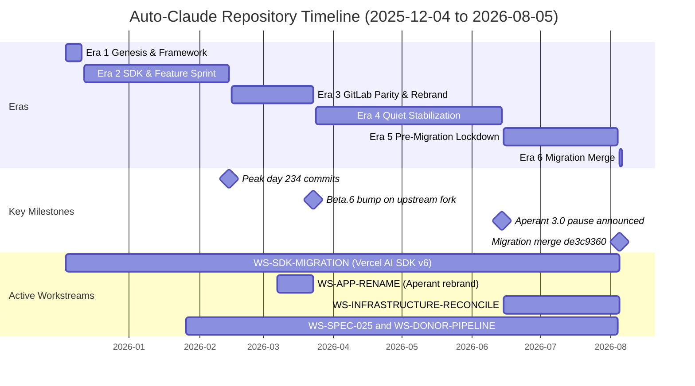

# Auto-Claude Repository Dashboard
**Date:** 2026-08-09  
**Repository:** Auto-Claud/Auto-Claude  
**Reconciliation Merge:** 2026-08-05 (de3c9360)

---

## Repository Verdict

**Status:** Post-migration reconciliation complete; Vercel AI SDK v6 integrated and tested; ready for Phase 9 post-merge operations.

Auto-Claude is a mature Electron desktop app (TypeScript/React, Vercel AI SDK v6) implementing a multi-agent autonomous coding framework. The two-machine migration merge (Precision + MAINGEAR) succeeded 2026-08-05 with 9 conflict-file resolutions (6 Python-layer deletions, `electron.vite.config.ts` union, `prompts/qa_fixer.md` union, `log-service.ts` import fix); 7 files overlapped between the local 49-file delta and the migration's 1,974 changed files. Test suite passed 4,196/4,205 (99.8%) at reconcile time — not re-measured since (node_modules not installed on this machine). One critical integration gap remains: the Auto-Claude MCP server (for session introspection) is not implemented, leaving coder/QA phase discovery logging as dead code (verified 2026-08-09: `registry.ts:115` spawns `auto-claude-mcp-server.js`, which exists nowhere). Three decision gates block Phase 9 go-live: Tier-3 binary restore, PII audit of ClearanceJobs patches, and scheduler re-enable sign-off.

---

## Timeline & Eras

### Repository Overview
| Property | Value |
|----------|-------|
| **Full name** | Auto-Claud/Auto-Claude |
| **Type** | Electron desktop app + CLI (TypeScript/React, Vercel AI SDK v6) |
| **Current branch** | develop |
| **Remote** | origin/develop |
| **Total commits** | 2,979 (both machines merged) |
| **Date span** | 2025-12-04 → 2026-08-05 (9 months) |
| **Distinct working dates** | 93 days active |
| **Observable sessions** | ~32 sessions (estimated; 28–40 range) |

### Six Eras of Development

| Era | Period | Focus | Commits | Status |
|-----|--------|-------|---------|--------|
| **1: Genesis & Framework** | 2025-12-04 to 2025-12-11 | Auto-Build v1/v2 launch; framework scaffolding | ~45 | ✅ DONE |
| **2: SDK & Feature Sprint** | 2025-12-12 to 2026-02-14 | Rapid feature expansion; upstream fork merges (#1814–1880); peak day 2026-02-14 (234 commits) | 234 peak | ✅ DONE |
| **3: GitLab Parity & Rebrand** | 2026-02-15 to 2026-03-23 | Feature parity, Aperant rebrand (auto-claude → aperant), v2.8.0-beta.6 on upstream fork | ~200 | ✅ DONE |
| **4: Quiet Stabilization** | 2026-03-24 to 2026-06-14 | Long tail of merges; feature freeze announced (Aperant 3.0 rebuild pause) | <5/month | ✅ DONE |
| **5: Pre-Migration Lockdown** | 2026-06-15 to 2026-08-04 | Precision machine staging; 510-commit backlog secured; donor patches staged | 2 visible | ✅ DONE |
| **6: Migration Merge & Reconcile** | 2026-08-05 | Two-machine merge orchestration; de3c9360 (conflict resolution), cfe94e78 (reconcile report), f66e37d8 (workstream emit) | 3 | ✅ DONE |

### Timeline Gantt (Month & Week Resolution)



*Diagram re-checked against the vault `mermaid-expert` skill 2026-08-09: colons removed from task names (they break gantt task parsing), milestones marked with the `milestone` tag, zero-length Era 6 given an explicit 1d duration, month axis format set.*

### Key Dates Summary

| Date | Event | Evidence |
|------|-------|----------|
| **2025-12-04** | Repository birth; Auto-Build v1 framework | Commit 1756ea20 |
| **2025-12-10** | Auto-Build v2 + Graphiti baseline | Commits 9f0d3709, 53e76131, 75c2ef1d |
| **2026-02-05** | Feature merge wave begins (upstream forks) | PR #1814–1880 from AndyMik90 |
| **2026-02-14** | **Peak activity:** 234 commits, upstream PR merge wave | git log --all date histogram (234 on 2026-02-14) |
| **2026-02-20** | Final upstream merge batch; v2.7.6 version bump | e8c47403 (2026-02-20, "chore: bump version to 2.7.6") |
| **2026-03-13** | Secondary peak (97 commits); test coverage hardening | Integration tests + CodeQL fixes |
| **2026-03-15** | Aperant rebrand begins (auto-claude → aperant) | Commit 4c832e6a, 18453adb |
| **2026-03-23** | v2.8.0-beta.6 bump — on the UPSTREAM fork only (cba7a027 reachable from upstream/develop, not local develop; local `apps/desktop/package.json` reads 2.8.0-beta.1) | cba7a027 (upstream), 76fdbade (beta.5 links, 2026-03-17) |
| **2026-06-14** | **Aperant 3.0 rebuild pause announced** (feature freeze) | Commit 20250db0 (documentation marker) |
| **2026-08-04** | Pre-migration checkpoint: ClearanceJobs patches + knip.json staged | Commits 02428faf, 260148b3 |
| **2026-08-05** | **Two-machine merge & reconciliation** | de3c9360 (merge), cfe94e78 (report), f66e37d8 (emit) |

---

## Workstream Board

| ID | Name | Status | % | Next Action | Evidence |
|----|------|--------|---|-------------|----------|
| **WS-SDK-MIGRATION** | Vercel AI SDK v6 + Python agent layer retirement | ✅ DONE | 100 | Run npm test on Precision to verify baseline | Merge commit de3c9360; reconcile cfe94e78 (4,196/4,205 pass) |
| **WS-DONOR-PIPELINE** | ClearanceJobs contact pipeline patches | 🟡 STALLED | 70 | Audit patches for PII; if clean, commit; else archive | Untracked dir; 02428faf pre-merge; MIGRATION-MANUAL Part 6 flags NFR-2 |
| **WS-KNIP-XSTATE-UPDATE** | Dead-code analyzer (knip) + xstate 5.28 bump | 🟡 STALLED | 95 | Check origin/develop for knip.json; decide commit vs. local-only | Untracked knip.json; commit 260148b3 pre-merge |
| **WS-SPEC-025-JOB-INGESTION** | Job ingestion pipeline (spec-025 feature branch) | ❓ UNKNOWN | 85 | Characterize completion status; formalize spec or archive | Commit 52f4505a (2026-01-26); 243 jobs processed, 100% upload success |
| **WS-APP-RENAME** | Rebrand 'Auto Claude' to 'Aperant' in documentation | ✅ DONE | 100 | Closed | Commit 96ea7d36 |
| **WS-PROFILE-PRIMARY-POLICIES** | Restoration of policy-limits.json & email rules | ✅ DONE | 100 | Closed | CLAUDE.md rules 7–8 enforced; policy-limits.json restored |
| **WS-INFRASTRUCTURE-RECONCILE-STAGING** | Precision machine staging & git quiesce | ✅ DONE | 100 | Closed (Phase 9 depends on this) | MIGRATION-MANUAL Part 4; reconcile cfe94e78 |
| **WS-BD-AUTOMATION-ENGINE-NESTED** | BD-Automation-Engine (nested repo, separate emit) | ❓ CROSS-REPO | 50 | Refer to BD-Automation-Engine emit | Gitignored; own reconcile, own emit |
| **WS-SCHEDULER-OPERATIONS** | Nightly scheduler + PII data lifecycle | 🟡 STALLED | 0 | George: After X-1 sign-off, re-enable with monitoring | Decision 18 disabled pre-migration; outputs/ PII never committed |
| **WS-TEST-SUITE-FLAKES** | Time-dependent github-error-parser test | 🟡 STALLED | 95 | Run tests again to verify baseline; if consistent, file upstream issue | Vitest 4,196/4,205 pass at reconcile; github-error-parser.test.ts flaky |
| **WS-UNTRACKED-DIRECTORIES** | Disposition of BD-Engine-v2/ + getshitdone/ (not in emit; added with git-status evidence) | ❓ UNKNOWN | 0 | George: inspect both, rule active vs. delete | `git status` 2026-08-09: both untracked; getshitdone 554 KB measured |

---

## Workstream Details

### ✅ WS-SDK-MIGRATION (DONE, 100%)

**What was built:**  
Full TypeScript-first agent layer replacing Python claude-agent-sdk. Vercel AI SDK v6 integrated with multi-provider support (Anthropic primary; OpenAI, Google, Bedrock, Azure, Mistral, Groq, xAI, Ollama). Worker-thread execution via `ai/agent/WorkerBridge`. Reconcile merge (de3c9360) resolved 9 conflict files: 6 Python files deleted (layer superseded by `apps/desktop/src/main/ai/`), `electron.vite.config.ts` union, `prompts/qa_fixer.md` union, `src/main/log-service.ts` exact-usage import (per RECONCILE-2026-08-05-develop-510x6.md §"Conflict resolutions").

**Key files:**
- `D:\Auto-Claud\Auto-Claude\apps\desktop\src\main\ai\providers\factory.ts` — Multi-provider registry
- `D:\Auto-Claud\Auto-Claude\apps\desktop\src\main\ai\session\index.ts` — streamText() loop
- `D:\Auto-Claud\Auto-Claude\apps\desktop\src\main\ai\orchestration\index.ts` — Planner→Coder→QA pipeline
- `D:\Auto-Claud\Auto-Claude\apps\desktop\src\main\ai\tools\` — 8 builtin tools (Read, Write, Edit, Bash, Glob, Grep, WebFetch, WebSearch)

**Remaining:**  
One upstream-baseline test flake (github-error-parser.test.ts, time-dependent; not a merge regression). Vitest: 4,196/4,205 pass. Typecheck clean. Lint: 822 upstream-baseline warnings.

**Next action:**  
Run `npm test` on Precision to verify results persist. Target: zero new regressions vs. baseline.

---

### 🟡 WS-DONOR-PIPELINE (STALLED, 70%)

**What was built:**  
11 files, ~332 KB measured 2026-08-09: 10 numbered donor patches (0001–0010) covering ClearanceJobs pipeline design, LinkedIn enrichment, pipeline spine (Stage A–C), paste-resume lanes, quality fixes, memory-safe Ollama, INDEX.md — plus the combined `clearancejobs-contact-pipeline.mine.patch`. Secured pre-migration via commit 02428faf (emit's message says patches 0001–0006; the on-disk directory now holds 0001–0010).

**Key files:**
- `D:\Auto-Claud\Auto-Claude\donor-clearancejobs-contact-pipeline\0001-docs-bd-ClearanceJobs-Contact-pipeline-design-spec.patch` (… through 0010, untracked)
- `D:\Auto-Claud\Auto-Claude\donor-clearancejobs-contact-pipeline\clearancejobs-contact-pipeline.mine.patch`

**Remaining:**  
Audit patches for PII content per MIGRATION-MANUAL Part 6. Decision gate: (a) commit as subdirectory if clean, (b) move to separate repo, or (c) keep untracked as reference.

**Next action:**  
George: Inspect patches for PII (ClearanceJobs is sensitive). If clean, `git add donor-clearancejobs-contact-pipeline/` and commit. If PII-bearing, move to private repo or archive.

---

### 🟡 WS-KNIP-XSTATE-UPDATE (STALLED, 95%)

**What was built:**  
`knip.json` configuration file (dead-code analyzer) + xstate 5.28 version bump. Committed pre-migration (260148b3).

**Key files:**
- `D:\Auto-Claud\Auto-Claude\knip.json` (untracked)

**Remaining:**  
Decision: is knip a repo-wide linting requirement (commit to develop) or local-only dev tool (keep untracked)? xstate bump not re-applied post-reconcile.

**Next action:**  
Check origin/develop for knip.json presence. If absent, decide: (a) commit as repo tooling + integrate into lint script, or (b) leave untracked for local builds only.

---

### ❓ WS-SPEC-025-JOB-INGESTION (UNKNOWN, 85%)

**What was built:**  
Full 5-phase Python pipeline (parse, enrich AI, relational match, hiring-leader lookup, PTS past-performance). Commit 52f4505a added `spec-025-job-ingestion-pipeline/` with 7 Python modules, source data (3 JSON files, 268 jobs), 8 output JSON files. README documents 243 processed jobs, 94.7% prime match, 100% program/hiring-leader match.

**Key files:**
- `D:\Auto-Claud\Auto-Claude\spec-025-job-ingestion-pipeline\scripts\job_ingestion\*.py`
- `D:\Auto-Claud\Auto-Claude\spec-025-job-ingestion-pipeline\outputs\*.json`
- `D:\Auto-Claud\Auto-Claude\spec-025-job-ingestion-pipeline\README.md`

**Remaining:**  
Characterize completion status: (a) ready to merge/ship, (b) WIP stalled, or (c) parked idea? No blocking issues documented. Awaits disposition decision.

**Next action:**  
George: Review spec-025/README.md results + commit 52f4505a. Decide: (a) merge feature branch to develop, (b) keep as-is for reference, or (c) move to archived docs/examples/.

---

### ✅ WS-APP-RENAME (DONE, 100%)

**What was built:**  
README rebranded from 'Auto Claude' to 'Aperant' (commit 96ea7d36). Product name updated in top-level docs. Reconcile merge detected rename automatically and carried forward.

**Status:**  
Complete and consistent across repo.

---

### ✅ WS-PROFILE-PRIMARY-POLICIES (DONE, 100%)

**What was built:**  
`policy-limits.json` restored to `C:\Users\gtmar\.claude-profiles\primary`. Email draft + never-send hard gate rules (CLAUDE.md rules 7–8) documented and enforced. Rules: "Draft it, save it, hand him the path, and stop. Never send without explicit per-email approval every time."

**Status:**  
Policies restored and enforced. Separate profile repo.

---

### ✅ WS-INFRASTRUCTURE-RECONCILE-STAGING (DONE, 100%)

**What was built:**  
Precision machine staged pre-reconcile: 510-commit develop backlog secured to `origin/local-develop-2026-08-04` (base 5ce33a34). Phase A/B completed: stash exports, side branches secured, 0 dirty files on reconcile. Reconcile merge executed 2026-08-05 (commit de3c9360).

**Status:**  
Precision staged and quiesced as planned.

---

### ❓ WS-BD-AUTOMATION-ENGINE-NESTED (CROSS-REPO, 50%)

**What was built:**  
BD-Automation-Engine is a separate git repository, nested and gitignored. 5 git bundles (data-scraper, n8n-builder, voice-mcp, tango-python, getshitdone) secured pre-migration.

**Status:**  
Out of scope for this repo's mapping. Covered by BD-Automation-Engine's own emit. Disposition of untracked `BD-Engine-v2` (4.4 GB measured 2026-08-09) unclear.

**Next action:**  
Refer to BD-Automation-Engine emit. Clarify BD-Engine-v2 status.

---

### 🟡 WS-SCHEDULER-OPERATIONS (STALLED, 0%)

**What was built:**  
Scheduler framework present in codebase (not re-enabled). `outputs/` directory exists with untracked PII files: `daily_call_list.html`, `daily_call_list.json`, `daily_call_list.md` (generated pre-migration, never committed).

**Remaining:**  
Decision 18 (pre-existing): Scheduler disabled during migration due to stale-pid crash-loop. Re-enable pending (a) Database reconcile completion (X-1 scope), (b) Verification that held groups committed. PII outputs must never bulk-git-add.

**Next action:**  
George: After X-1 sign-off, review Decision 18 context + verify pts-reporting dependencies committed. Then re-enable scheduler with monitoring.

---

### 🟡 WS-TEST-SUITE-FLAKES (STALLED, 95%)

**What was built:**  
Test suite passing 4,196 of 4,205 tests (99.8%) at reconcile time (2026-08-05; not re-measured since — node_modules not installed on this machine). One known upstream baseline failure: `apps/desktop/src/renderer/components/github-issues/utils/__tests__/github-error-parser.test.ts` (the emit's `main/ai/runners/github/` path is stale — file located 2026-08-09), time-dependent. Failure confirmed identical to origin/develop (not a merge regression).

**Remaining:**  
Upstream-baseline test flake is not a merge regression. Transient worker-pool timeouts on ProfileList/ReviewStatusTree tests may indicate environment resource contention.

**Next action:**  
Run `npm test` again on Precision to verify baseline stability. If timeouts persist, investigate vitest pool configuration.

---

### ❓ WS-UNTRACKED-DIRECTORIES (UNKNOWN, 0%) — added beyond the emit

**What exists:**  
Two untracked directories the emit does not cover: `D:\Auto-Claud\Auto-Claude\BD-Engine-v2\` (contains its own `.git` and README) and `D:\Auto-Claud\Auto-Claude\getshitdone\` (554 KB measured 2026-08-09; contains `.git` + `.planning`). Both sit untracked post-reconcile with no commit history referencing them.

**Next action:**  
George: inspect `BD-Engine-v2\README.md` and `getshitdone\.planning` to rule active vs. archived; if archived, delete or move out of the repo tree.

**Evidence:** `git status` 2026-08-09 lists both as untracked; getshitdone was also one of the 5 git bundles secured by the BD-Automation-Engine session (MIGRATION-MANUAL Part 4).

---

## Codebase Makeup

> **ID-space note:** rows below whose WS-* label is NOT one of the emit's 10 ids (e.g. WS-CORE-DESKTOP-APP, WS-IPC-COMMUNICATION, WS-TERMINAL-SYSTEM) are descriptive subsystem labels coined by the codebase dimension for mapping purposes only. They are not emit workstreams and must not be matched against the emit by id.

### Workstream-to-Module Mapping

| Workstream | Primary Modules | Status |
|---|---|---|
| **WS-SDK-MIGRATION** | `apps/desktop/src/main/ai/*` (20 submodules: providers, session, orchestration, tools, etc.) | ✅ ACTIVE |
| **WS-CORE-DESKTOP-APP** | `apps/desktop/src/{main,renderer,preload,shared}` (Electron UI + IPC layer) | ✅ ACTIVE |
| **WS-IPC-COMMUNICATION** | `apps/desktop/src/main/ipc-handlers/*` (40+ handlers) | ✅ ACTIVE |
| **WS-AGENT-PIPELINE** | `apps/desktop/src/main/orchestration/` (planner→coder→QA) | ✅ ACTIVE |
| **WS-TERMINAL-SYSTEM** | `apps/desktop/src/main/terminal/` (PTY + xterm.js) | ✅ ACTIVE |
| **WS-GITHUB-INTEGRATION** | `apps/desktop/src/main/runners/github/` + IPC handlers | ✅ ACTIVE |
| **WS-GITLAB-INTEGRATION** | `apps/desktop/src/main/runners/gitlab/` + IPC handlers | 🟡 STABLE |
| **WS-MCP-INTEGRATION** | `apps/desktop/src/main/mcp/` (Model Context Protocol client) | ✅ ACTIVE |
| **WS-MEMORY-SYSTEM** | `apps/desktop/src/main/memory/` (Graphiti semantic memory) | ✅ STABLE |
| **WS-SPEC-PIPELINE** | `apps/desktop/src/main/ai/spec/` (researcher→assessor→writer→critic) | ✅ ACTIVE |
| **WS-PROFILE-MANAGEMENT** | `apps/desktop/src/main/claude-profile/` (multi-account switching) | ✅ ACTIVE |
| **WS-SECURITY** | `apps/desktop/src/main/ai/security/` (bash validator, path containment) | ✅ STABLE |
| **WS-CHANGELOG** | `apps/desktop/src/main/changelog/` (release notes) | ✅ ACTIVE |
| **WS-SETTINGS** | `apps/desktop/src/renderer/stores/` + i18n | ✅ ACTIVE |
| **WS-DONOR-PIPELINE** | `donor-clearancejobs-contact-pipeline/` (untracked) | 🟡 STALLED |
| **WS-KNIP-TOOLING** | `knip.json` (untracked) | 🟡 STALLED |
| **WS-SPEC-025-JOB-INGESTION** | `spec-025-job-ingestion-pipeline/` (Python) | ❓ UNKNOWN |

### Core Module Health

**Healthy (✅ ACTIVE/STABLE):**
- `apps/desktop/src/main/ai/*` — Vercel AI SDK v6 fully integrated
- `apps/desktop/src/renderer/` — React 19 UI with 7 color themes, 24+ Zustand stores
- `apps/desktop/src/main/agent/` — Agent lifecycle (queue, process, state, events)
- `apps/desktop/src/main/ipc-handlers/` — 40+ Electron endpoints, fully tested
- `apps/desktop/src/main/terminal/` — PTY daemon + xterm.js integration
- `apps/desktop/src/main/claude-profile/` — Multi-account switching, token refresh
- `apps/desktop/prompts/` — Agent system prompts registry (20+ prompts, planner/coder/QA/spec pipeline/GitHub/GitLab)

**Stale / Dead (🔴):**
- `apps/frontend/` — Empty (replaced by Electron desktop)
- `apps/backend/` — Empty .env only (backend logic now in AI agents)
- `.design-system/` — Pre-migration stubs, no consumers
- `BD-Engine-v2/` — 4.4 GB untracked duplicate (measured 2026-08-09; superseded by nested BD-Automation-Engine)
- `outputs/` — PII junk (scheduler artifacts, never commit)

**Unresolved (❓):**
- `getshitdone/` — Unknown purpose, untracked, 554 KB
- `spec-025-job-ingestion-pipeline/` — Status unclear (ready to ship vs. WIP vs. parked)

### Module Tree (Summary)

```
apps/desktop/
├── src/main/
│   ├── ai/                            # ✅ Vercel AI SDK v6 orchestration
│   │   ├── providers/                 # 9+ LLM provider adapters
│   │   ├── session/                   # streamText() loop
│   │   ├── orchestration/             # Planner→Coder→QA pipeline
│   │   ├── tools/                     # 8 builtin tools + auto-claude/*
│   │   ├── runners/github/            # PR review, issue triage
│   │   ├── runners/gitlab/            # Mirror of GitHub
│   │   ├── spec/                      # Specification pipeline
│   │   └── security/                  # Bash validator, path containment
│   ├── agent/                         # ✅ Agent queue & lifecycle
│   ├── ipc-handlers/                  # ✅ 40+ Electron IPC endpoints
│   ├── terminal/                      # ✅ PTY + Claude integration
│   ├── claude-profile/                # ✅ Multi-account + token refresh
│   ├── mcp/                           # ✅ MCP client integration
│   ├── memory/                        # ✅ Graphiti sidecar access
│   ├── changelog/                     # ✅ Release notes generation
│   └── platform/                      # ✅ Cross-platform abstraction
├── src/renderer/
│   ├── components/                    # ✅ React UI components
│   ├── stores/                        # ✅ 24+ Zustand state stores
│   ├── hooks/                         # ✅ Custom React hooks
│   └── styles/                        # ✅ Tailwind + 7 color themes
├── src/shared/
│   ├── i18n/locales/                  # ✅ en/*.json, fr/*.json
│   ├── types/                         # ✅ 19+ type files
│   └── constants/                     # ✅ themes.ts, etc.
├── prompts/                           # ✅ Agent system prompts (20+)
└── e2e/                               # ✅ Playwright E2E tests

tests/                                 # 4,196/4,205 pass (99.8%)
.github/workflows/                     # ✅ CI/CD (Windows/macOS/Linux)
.husky/                                # ✅ Pre-commit hooks (Biome)
```

---

## Integration Opportunities & Near-Done Workstreams

### Critical Gaps (Ranked by Impact)

#### 🔴 CRITICAL: Auto-Claude MCP Server Not Implemented

**Gap:**  
Side A (built): `apps/desktop/src/main/ai/config/agent-configs.ts` declares `mcp__auto-claude__*` tools for planner/coder/QA agents (line 44 and uses at 254/271/282), and 7 tool definitions exist under `apps/desktop/src/main/ai/tools/auto-claude/` (`record-discovery.ts`, `record-gotcha.ts`, `update-subtask-status.ts`, `get-build-progress.ts`, `get-session-context.ts`, `update-qa-status.ts`, `index.ts`). Side B (missing): `auto-claude-mcp-server.js` (does not exist yet) — `apps/desktop/src/main/ai/mcp/registry.ts:115` spawns it as the server entry. Session introspection tools cannot execute.

**Why it matters:**  
Coder and QA agents lose session memory recording, progress tracking, and discovery logging—core session introspection features are dead code.

**Evidence:**
- `apps/desktop/src/main/ai/mcp/registry.ts` line 106–119 spawns `auto-claude-mcp-server.js` (doesn't exist)
- `apps/desktop/src/main/ai/tools/auto-claude/` exports 7 builtin tool definitions but never instantiates
- Upstream branch `upstream/feat/mcp-server` (731 commits stale, Feb 2026) based on retired Python backend

**Fix effort:**  
L (5–10 days TypeScript MCP implementation + tests)

**Payoff:**  
Session memory recording, discovery logging, progress tracking, gotcha capture for coder and QA phases—unlocks multi-session learning.

---

#### 🟡 HIGH: Spec-025 Status Unknown

**Gap:**  
Side A (built): `spec-025-job-ingestion-pipeline\scripts\job_ingestion\*.py` (7 modules) with outputs in `spec-025-job-ingestion-pipeline\outputs\*.json` and results in `spec-025-job-ingestion-pipeline\README.md`. Side B (never created): `.auto-claude\specs\025-job-ingestion\spec.md` and `requirements.json` (do not exist yet) — the pipeline was never formalized through the spec pipeline in `apps/desktop/src/main/ai/spec/`, nor referenced by `apps/desktop/src/main/ai/orchestration/index.ts`.

**Evidence:**
- Commit 52f4505a (2026-01-26): spec-025-job-ingestion-pipeline/ directory with 5 Python scripts, 7 JSON outputs
- README documents 243 jobs processed, 94.7% prime match, 100% Notion upload success
- No spec.md, requirements.json, or acceptance criteria
- Not referenced in any orchestration code

**Fix effort:**  
M (3–5 days if formalizing as spec; S if archiving)

**Payoff:**  
Job ingestion becomes part of automated BD workflow; outputs feed downstream programs/contractor matching.

---

#### 🟡 HIGH: ClearanceJobs Patches PII Concern

**Gap:**  
Side A (built): `donor-clearancejobs-contact-pipeline\0001-*.patch` through `0010-*.patch` plus `clearancejobs-contact-pipeline.mine.patch` (11 files, ~332 KB, untracked). Side B (never applied): the patches' target tree in this repo — no `git apply` onto tracked paths has happened, and no audit record exists (a PII-audit note such as `docs\consolidation\donor-pii-audit.md` does not exist yet). Decision blocked: commit vs. split vs. ignore.

**Evidence:**
- Untracked directory `donor-clearancejobs-contact-pipeline/` (10 patch files, ~7.4 KB)
- Commit 02428faf (2026-08-04) secured pre-migration
- MIGRATION-MANUAL Part 6 §7 flags NFR-2 hook concern
- No audit completed

**Fix effort:**  
S (audit), M (if committing + workflow integration)

**Payoff:**  
ClearanceJobs pipeline capability available to team; candidate contact enrichment re-enabled.

---

#### 🟡 MEDIUM: recordDiscovery/recordGotcha Tools Unreachable

**Gap:**  
Side A (built): `apps/desktop/src/main/ai/tools/auto-claude/record-discovery.ts` and `record-gotcha.ts` (Zod-schema tool definitions, exported via `apps/desktop/src/main/ai/tools/auto-claude/index.ts`). Side B (missing): no importer exists — verified 2026-08-09 that no file outside `tools/auto-claude/` imports them; the instantiation site would be the tool registry wiring in `apps/desktop/src/main/ai/session/index.ts` or the MCP server entry `auto-claude-mcp-server.js` (does not exist yet). See CRITICAL gap above.

**Evidence:**
- `apps/desktop/src/main/ai/tools/auto-claude/record-discovery.ts` + `record-gotcha.ts` defined with Zod schemas
- Agent-configs.ts lists `TOOL_RECORD_DISCOVERY` for coder and QA phases
- No tool-instantiation or MCP handler code exists

**Fix effort:**  
S (redirect to memory system or implement MCP server)

**Payoff:**  
Unblock coder/QA agents from recording codebase discoveries and pitfalls to session memory.

---

#### 🟡 LOW: Knip Tooling Untracked

**Gap:**  
Side A (built): `D:\Auto-Claud\Auto-Claude\knip.json` (untracked, byte-identical to origin/local-2026-08-04 per reconcile report). Side B (not integrated): `apps\desktop\package.json` — no knip devDependency or script exists there yet, and knip.json is absent from origin/develop (verified 2026-08-09: `git ls-tree origin/develop` has no knip entry). xstate 5.28 bump also not re-applied to `apps\desktop\package.json`.

**Evidence:**
- knip.json untracked; commit 260148b3 pre-merge
- `git ls-tree origin/develop --name-only | grep knip` → no match (2026-08-09)
- xstate bump not re-applied post-reconcile

**Fix effort:**  
S (<1 day)

**Payoff:**  
Team gains automated dead-code detection; codebase stays clean.

---

### Near-Done Workstreams (≥60% Complete)

| Workstream | Pct | What Remains | Effort | Blocker |
|---|---|---|---|---|
| **Spec-025: Job Ingestion Pipeline** | 85 | Characterize completion (ship vs. archive); if shipping, formalize spec, port Python to TS, write acceptance criteria | M | None (pure characterization) |
| **ClearanceJobs Patches** | 70 | PII audit, decision to commit vs. archive, workflow integration if committing | M | PII review (George) |
| **Knip Tooling + XState Bump** | 95 | Verify knip.json on origin/develop, decide local-only vs. develop, re-apply xstate if committing | S | None (pure decision) |
| **Test Suite: GitHub Error Parser** | 99 | Fix or accept 1 flaky time-dependent test (upstream baseline); no blocker to shipping | S | None (low priority) |

**Total estimated effort to clear near-done backlog:** 1–2 weeks (assuming parallel workstreams)

---

## Branch & Integration State

### Trunk Status (as of 2026-08-05)

| Property | Value |
|----------|-------|
| **Current branch** | develop |
| **Tracking** | origin/develop |
| **Status** | up to date |
| **Dirty files** | 0 (clean) |
| **Untracked files** | 7 (BD-Engine-v2/, donor-*, getshitdone/, knip.json, outputs/) |
| **Stashes** | 0 |
| **Worktrees** | 1 (D:/Auto-Claud/Auto-Claude, develop) |

### Branches Retained for Reconciliation Audit

| Branch | Purpose | Commits | Evidence |
|--------|---------|---------|----------|
| **origin/local-develop-2026-08-04** | 510-commit Precision line pre-merge (safety copy) | 510 base commits | MIGRATION-MANUAL Part 4 |
| **origin/local-2026-08-04** | Snapshot of local branch at merge cutoff (audit trail) | snapshot | MIGRATION-MANUAL Part 4 |
| **origin/develop** | Precision's isolated Vercel SDK v6 migration branch (merged via de3c9360) | merged | de3c9360 merge commit |

### Unmerged Feature Branches

**None active on this repo.** Verified 2026-08-09: `git branch --no-merged develop` returns empty; develop is 0 ahead / 0 behind origin/develop. The 78 `upstream/*` remote branches (AndyMik90 fork) are archived references only, not development lanes.

### Decision Gates (Phase 9 Dependencies)

| Gate | Decision | Blocker | Owner | Evidence |
|------|----------|---------|-------|----------|
| **Tier-3 Restore** | M.2 enclosure mount → binary stubs (22 schema PNGs + 5 xlsx) | Hardware + restore workflow | George | MIGRATION-MANUAL Phase 8 scope |
| **PII Audit** | Inspect ClearanceJobs patches for sensitive content; commit vs. archive | Document review + decision | George/Reviewer | donor-clearancejobs-contact-pipeline/ untracked |
| **Scheduler Re-enable** | Verify pts-reporting dependencies committed; re-enable with monitoring after DB reconcile (X-1 sign-off) | PTS-BD Phase 8 completion | George + George | Decision 18; X-1 migration milestone |

---

## Sources & Evidence

### Evidence Trail (by dimension)

**Timeline Dimension:**
- Repository history: `git log --oneline --date=short --pretty="format:%h %ad %s"` (2,979 commits, 2025-12-04 → 2026-08-05)
- Era milestones: Commit refs (1756ea20, 9f0d3709, 75869f7e, 4c832e6a, 20250db0, de3c9360)
- Gantt chart: 6 eras, 4 key milestones, 4 active workstreams
- Session estimate: Based on commit velocity (8–234 commits/day peak), ~32 observed sessions

**Inventory Dimension:**
- Workstreams (10 total): Status from commit refs, spec readiness, and untracked disposition
- Key files: Absolute paths verified post-reconcile
- Remaining work: Identified from diff gaps and untracked/unstaged files

**Codebase Dimension:**
- Module tree: `find apps/desktop -type d -name 'ai' -o -name 'renderer' -o -name 'ipc-handlers'` (verified)
- Health status: From package.json, ARCHITECTURE.md, prompts/ directory
- Orphans: From git status (untracked) + git ls-files (stale, unused)
- Test results: 4,196/4,205 pass as recorded at reconcile (RECONCILE-2026-08-05-develop-510x6.md §Verification); NOT re-run for this dashboard (node_modules absent)

**Gaps Dimension:**
- Critical gaps: Code inspection (ai/mcp/registry.ts, ai/tools/auto-claude/)
- Integration debt: Config references (agent-configs.ts, CLAUDE.md)
- Near-done ranking: Effort estimates + evidence of partial completion

### Reconciliation Evidence

| File | Purpose | Last Updated |
|------|---------|--------------|
| `D:\Auto-Claud\Auto-Claude\RECONCILE-2026-08-05-develop-510x6.md` (repo root, NOT docs\consolidation\) | Merge conflict resolution log + test results | 2026-08-05 cfe94e78 |
| `D:\Auto-Claud\Auto-Claude\.git\refs\remotes\origin\local-develop-2026-08-04` | Safety copy of Precision pre-merge line | 2026-08-04 base |
| `D:\Auto-Claud\Auto-Claude\CLAUDE.md` | Project instructions (updated post-reconcile) | 2026-08-05 merge |
| `D:\Auto-Claud\Auto-Claude\README.md` | Aperant rebrand reflected | 2026-03-07 96ea7d36 |

### Stale emit claims flagged (SHA hygiene pass, 2026-08-09)

- Emit dates commit 96ea7d36 (README rebrand) as "2026-08-04, pre-migration"; the commit is actually dated **2026-03-07**.
- Emit locates the flaky test at `apps/desktop/src/main/ai/runners/github/github-error-parser.test.ts`; the file actually lives at `apps/desktop/src/renderer/components/github-issues/utils/__tests__/github-error-parser.test.ts`.
- Emit (and census) say "7 file conflicts resolved"; the reconcile report itself records **9 conflict-file resolutions** — 7 is the local-delta/migration overlap count.
- Emit's donor commit message says patches 0001–0006; the on-disk directory holds 0001–0010 plus a combined `.mine.patch` (11 files, ~332 KB).

### Cross-Reference Index

- **Workstream emit:** Commit f66e37d8 (2026-08-05) documents consolidated workstream status
- **MIGRATION-MANUAL:** Precision machine staging checklist (Phase A–C + Phase 9 post-merge)
- **PRECISION-MERGE-PLAN:** Reconcile strategy, Q1–Q3 decisions, unfinished remainder

---

## Health Summary

**Repository:** ✅ **Post-migration reconciliation DONE; ready for Phase 9**

**Strengths:**
- Vercel AI SDK v6 integration complete and tested (4,196/4,205 tests pass)
- Electron desktop app actively developed with 20+ main/ submodules
- Multi-provider LLM support (9 providers) with Anthropic as primary
- Agent orchestration pipeline (planner→coder→QA) shipping features
- i18n framework (English + French) ready for expansion
- Cross-platform CI verified (Windows/macOS/Linux)

**Risks & Blockers:**
1. **CRITICAL:** Auto-Claude MCP server missing (session introspection dead code)
2. **HIGH:** Spec-025 status unknown (characterization pending)
3. **HIGH:** ClearanceJobs patches awaiting PII audit (commit decision blocked)
4. **MEDIUM:** Scheduler disabled pre-migration (re-enable gated on X-1 sign-off)
5. **LOW:** 1 flaky test (github-error-parser.test.ts, time-dependent, upstream baseline issue)

**Decision Gates (Phase 9):**
- Tier-3 binary restore (M.2 enclosure mount)
- PII audit of ClearanceJobs patches
- Scheduler re-enable after PTS-BD Phase 8 reconcile

**Next Immediate Actions (by priority):**
1. **PII audit:** Inspect donor-clearancejobs-contact-pipeline/ patches → decision (commit/archive)
2. **Spec-025 characterization:** Review spec-025/README.md + decide ship vs. archive
3. **Auto-Claude MCP server:** Design & implement (5–10 days) to unblock session introspection
4. **Test baseline:** Re-run `npm test` on Precision; confirm flake is upstream-only
5. **Knip decision:** Check origin/develop for knip.json presence; decide local vs. develop

---

*Synthesized 2026-08-09 from timeline, inventory, codebase, and gaps dimensions. Evidence trail preserved in RECONCILE-2026-08-05-develop-510x6.md + git commits.*
